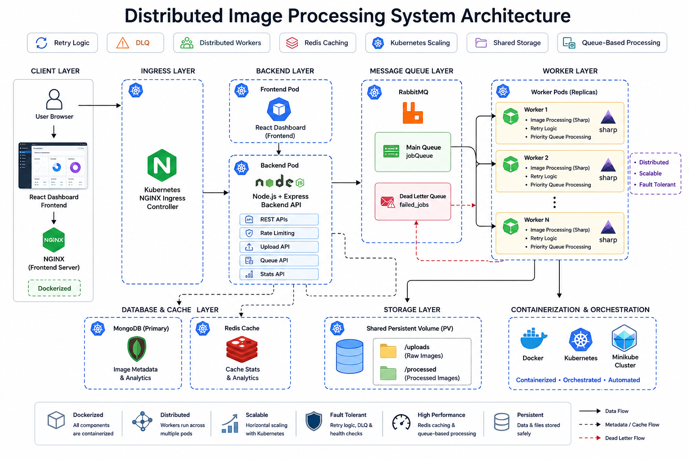
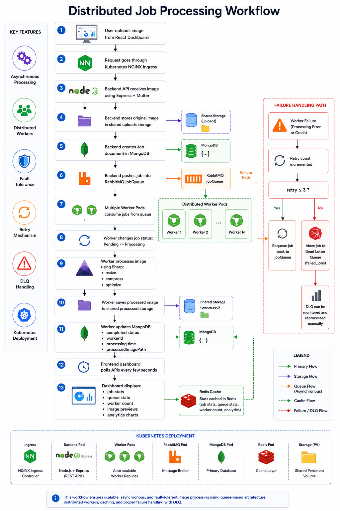
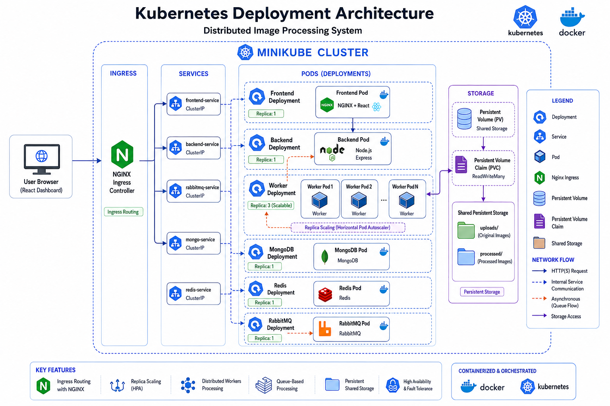
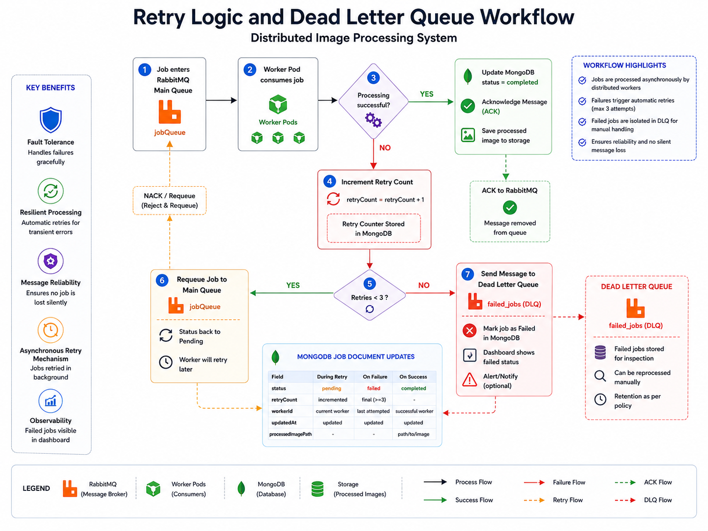

<div align="center">

# 🖼️ Distributed Image Processing System

### A distributed asynchronous image processing system built with Node.js, RabbitMQ, Redis, Docker, and Kubernetes

<br/>


</div>

---

# 📌 Overview

A distributed backend system that handles image uploads asynchronously through a message queue pipeline using RabbitMQ and distributed worker consumers.

The system processes images in the background using Sharp, stores metadata in MongoDB, caches statistics using Redis, and exposes real-time monitoring through a React dashboard.

This project demonstrates practical backend engineering concepts including:
- asynchronous job processing
- distributed workers
- retry handling
- dead letter queues
- Redis caching
- Docker containerization
- Kubernetes orchestration
- shared persistent storage

---

# ✨ Features

## Backend & Processing
- Multipart image upload API
- Asynchronous queue-based processing using RabbitMQ
- Distributed worker consumers
- Image resizing and compression using Sharp
- Retry mechanism for failed jobs
- Dead Letter Queue (DLQ) support
- Worker heartbeat monitoring
- Application-level priority-based job scheduling

## Dashboard & Monitoring
- Real-time job monitoring
- Queue statistics
- Worker tracking
- Original and processed image preview
- Analytics charts using Recharts

## Infrastructure & DevOps
- Dockerized architecture
- Kubernetes deployment using Minikube
- NGINX Ingress routing
- Shared PersistentVolumeClaim for images
- Horizontally scalable workers

---

# 🧠 Tech Stack

| Layer | Technology |
|---|---|
| Backend | Node.js, Express.js |
| Database | MongoDB |
| Queue System | RabbitMQ |
| Cache | Redis |
| Image Processing | Sharp, Multer |
| Frontend | React, Vite, Tailwind CSS |
| Charts | Recharts |
| Containerization | Docker |
| Orchestration | Kubernetes, Minikube |
| Ingress | NGINX Ingress Controller |

---

# 📂 Project Structure

```bash
distributed-task-processor/
│
├── app.js
├── worker.js
├── Dockerfile
├── Dockerfile.worker
│
├── src/
│   ├── config/
│   ├── controllers/
│   ├── middleware/
│   ├── models/
│   └── routes/
│
├── uploads/
├── processed/
│
├── dashboard/
│   └── src/
│
└── k8s/
    ├── backend.yaml
    ├── frontend.yaml
    ├── worker.yaml
    ├── mongo.yaml
    ├── rabbitmq.yaml
    ├── redis.yaml
    ├── storage.yaml
    └── ingress.yaml
```

---

# 🏗️ System Architecture

<p align="center">
  
</p>

The system consists of three major layers:

- **API Layer** → Accepts uploads and sends jobs to RabbitMQ
- **Worker Layer** → Consumes jobs and processes images
- **Data Layer** → MongoDB, Redis, RabbitMQ, and Persistent Storage

The frontend dashboard communicates with the backend through Kubernetes Ingress routing.

---

# 🔄 Job Processing Workflow

<p align="center">
  
</p>

## Workflow Steps

1. User uploads image through dashboard or API
2. Backend stores image inside `uploads/`
3. Job metadata is stored in MongoDB
4. Job message is pushed to RabbitMQ
5. Worker consumes the message
6. Worker processes image using Sharp
7. Processed image is stored inside `processed/`
8. Job status is updated in MongoDB
9. Dashboard fetches live updates

---

# ☸️ Kubernetes Architecture

<p align="center">
  
</p>

The application runs inside a Kubernetes cluster using Minikube.

Each service runs independently:
- Backend Deployment
- Frontend Deployment
- Worker Deployment
- MongoDB Deployment
- RabbitMQ Deployment
- Redis Deployment

NGINX Ingress routes:
- `/api/*` → backend service
- `/` → frontend service

Workers and backend share the same PersistentVolumeClaim for image access.

---

# ♻️ Retry Logic & Dead Letter Queue

<p align="center">
  
</p>

If image processing fails:
- Retry count increases
- Job is retried up to 3 times
- Failed jobs move to the Dead Letter Queue (`failed_jobs`)

This prevents infinite retry loops and keeps failed jobs isolated.

---

# ⚡ Redis Caching

Redis is used for:
- Dashboard statistics caching
- Queue statistics caching
- Reducing repeated MongoDB queries

Short TTL values help maintain near real-time data.

---

# 👷 Worker System

Workers are independent Node.js consumers connected to RabbitMQ.

Each worker:
- consumes one job at a time
- processes images using Sharp
- updates MongoDB
- sends heartbeat updates

Workers can be scaled horizontally:

```bash
kubectl scale deployment worker --replicas=5 -n image-system
```

---

# 🐳 Docker Setup

## Build Images

```bash
docker build -t distributed-task-processor-backend:v1 .
docker build -f Dockerfile.worker -t distributed-task-processor-worker:v1 .
```

## Run System

```bash
docker compose up --build
```

---

# ☸️ Kubernetes Setup

## Start Minikube

```bash
minikube start --driver=docker --memory=4096 --cpus=4
```

## Enable Ingress

```bash
minikube addons enable ingress
```

## Deploy Kubernetes Resources

```bash
kubectl create namespace image-system

kubectl apply -f k8s/ -n image-system
```

## Access Application

```bash
minikube ip
```

Open:

```bash
http://<MINIKUBE-IP>
```

---

# 📤 API Endpoints

## Upload Image

```bash
curl -X POST http://<MINIKUBE-IP>/api/jobs/upload \
  -F "image=@/path/to/image.png"
```

## Add Manual Job

```bash
curl -X POST http://<MINIKUBE-IP>/api/jobs/add
```

## Get Jobs

```bash
curl http://<MINIKUBE-IP>/api/jobs
```

## Get Statistics

```bash
curl http://<MINIKUBE-IP>/api/jobs/stats
```

---

# 🔥 Load Testing

## Upload Same Image 50 Times

```bash
for i in {1..50}; do
  curl -X POST http://<MINIKUBE-IP>/api/jobs/upload \
    -F "image=@/home/kunal/Downloads/testing1.png" &
done
wait
```

---

# 📊 Dashboard Features

The dashboard provides:
- Live queue monitoring
- Job status tracking
- Worker activity tracking
- Original image preview
- Processed image preview
- Analytics charts
- Failed job tracking

---

# 🚀 Future Improvements

- Horizontal Pod Autoscaler (HPA)
- JWT Authentication
- Prometheus + Grafana Monitoring
- WebSocket Live Updates
- CI/CD Pipelines
- Object Storage Integration
- Native RabbitMQ Priority Queues

---

# 📚 Learning Outcomes

This project helped in understanding:
- Distributed systems
- Asynchronous processing
- Message queues
- Worker scaling
- Docker containerization
- Kubernetes deployments
- Persistent storage
- Redis caching
- Fault-tolerant systems

---


---

# 👨‍💻 Author

**Kunal Jambhale**

[](https://github.com/kunaljambhale06)

---

<div align="center">

⭐ Star this repo if you found it useful.

</div>